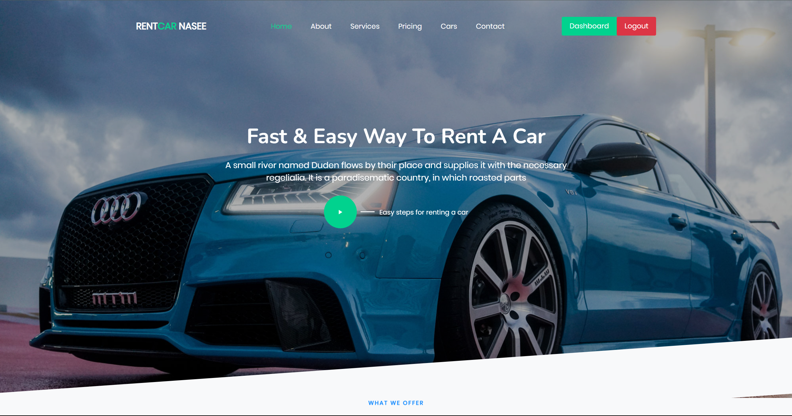

## RentCar NaSee
RentCar NaSee adalah sebuah program rental mobil yang memberikan kemudahan dan kenyamanan bagi pelanggan yang ingin menyewa mobil dengan cepat dan efisien. Program ini didesain untuk memenuhi kebutuhan individu, keluarga, atau perusahaan yang membutuhkan kendaraan untuk keperluan pribadi atau bisnis.

Frontend dari program ini menggunakan Laravel, sedangkan untuk backendnya menggunakan Go Language dengan Rest API.

## Links
Link Repository Backend yang digunakan : https://github.com/denyandriawan01/Backend_WebProg_RentalCarManagement

Link Proposal : https://drive.google.com/file/d/1Nidt-hqeIV8CEVHK06gM0Np-pLHJzG2O/view?usp=sharing

Link Video : https://youtu.be/vAwTRsO6Cqg
